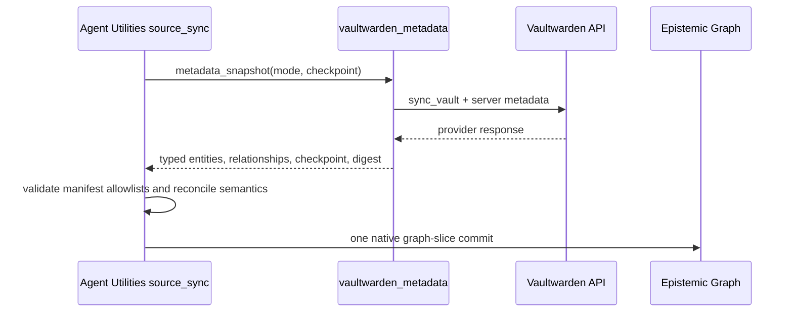

# Metadata source contract

Vaultwarden is a read-only structural source for the knowledge graph. Agent Utilities
calls the certified `vaultwarden-metadata` preset, which invokes
`vaultwarden_metadata(action="metadata_snapshot")` and receives a
`vaultwarden.metadata-entities/v1` envelope.

The projection contains only opaque identifiers, type codes, lifecycle timestamps,
counts, version strings, and declared relationships. It never contains document text,
item or folder names, usernames, passwords, notes, URIs, TOTP values, custom fields,
attachment contents, encrypted payloads, or key material.

The preset declares `record_mode: typed_entities`, an empty `content_fields` list,
and an explicit `metadata_fields` allowlist. Its deliberately nonexistent
`text_field` makes a generic document adapter fail closed. The old
`vaultwarden-ciphers` document preset and the connector-local graph-write functions
no longer exist, so there is one source and one commit authority.

Delta calls accept the last committed ISO-8601 checkpoint. Changed item nodes retain
the locally resolved folder, organization, and collection closure required by their
edges; an unchanged delta returns an empty, digest-bound structural no-op. Full calls
return the complete projection. Reconcile calls additionally mark the sorted
`live_ids` set as authoritative. Agent Utilities alone applies tombstones and
advances the checkpoint.

Backfeed is unsupported. The preset and response both declare read-only operation, and
`backfeed_metadata` refuses before making any provider call. A future write-back
contract would require a separately reviewed field allowlist and approval boundary.
